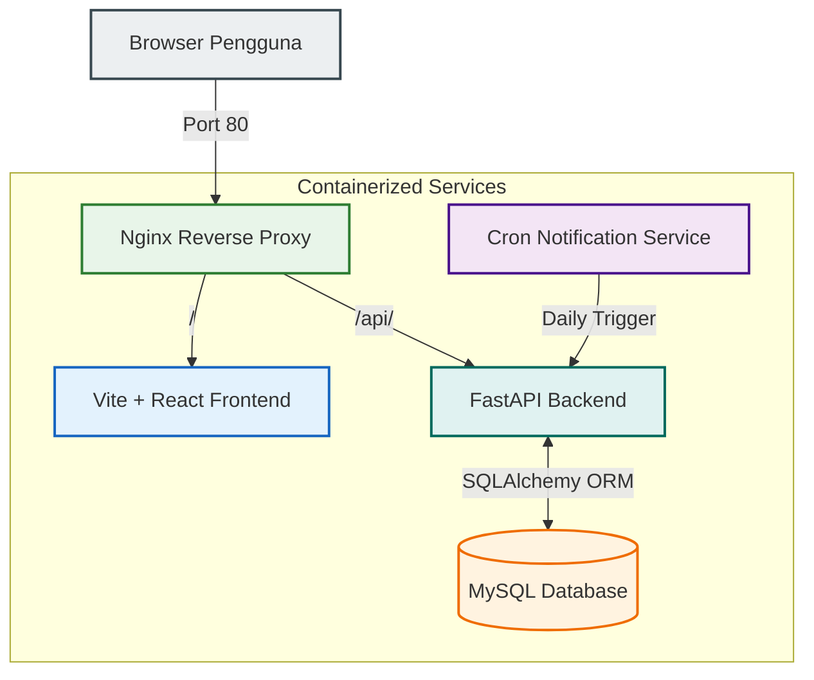

# 🏆 ChamPart (Champion Partner) - Portal Kegiatan & TAK Mahasiswa

[](https://www.docker.com/)
[](https://fastapi.tiangolo.com/)
[](https://react.dev/)
[](https://tailwindcss.com/)
[](https://www.mysql.com/)

**ChamPart (Champion Partner)** adalah platform web terintegrasi yang dirancang khusus untuk memfasilitasi mahasiswa dalam mencari, menyimpan, dan mengikuti berbagai kegiatan kemahasiswaan guna memenuhi standar **Transkrip Aktivitas Kemahasiswaan (TAK)**. Platform ini mencocokkan kegiatan berdasarkan **Minat** dan **Bakat** unik yang dimiliki mahasiswa untuk menghasilkan rekomendasi yang relevan.

Proyek ini dibangun sebagai bagian dari mata kuliah **Implementasi dan Pengujian Perangkat Lunak (IMPAL)**.

---

## 🗺️ Arsitektur Sistem (System Architecture)

Platform ChamPart dirancang dengan arsitektur modern berbasis microservices/containerized services, dihubungkan melalui sebuah Nginx Reverse Proxy tunggal untuk efisiensi perutean dan pencegahan isu CORS.



---

## ✨ Fitur Utama (Core Features)

1. **Pencocokan Minat & Bakat (Interest & Talent Matching)**
   * Mahasiswa dapat menentukan minat (e.g. Kepemimpinan, Kewirausahaan) dan bakat (e.g. Public Speaking, Programming).
   * Sistem secara cerdas mengelompokkan dan merekomendasikan kegiatan yang sesuai.

2. **Manajemen Transkrip Aktivitas Kemahasiswaan (TAK)**
   * Setiap kegiatan memiliki bobot poin TAK (**nominal_TAK**).
   * Kategori kegiatan terbagi menjadi TAK Wajib dan TAK Pilihan.

3. **Peran Pengguna Multi-Level (Multi-Level User Roles)**
   * **Pengguna / Mahasiswa**: Mencari kegiatan, menandai (bookmark) kegiatan, mengedit profil, dan memantau riwayat kegiatan.
   * **Admin Instansi**: Mengunggah detail kegiatan baru, mengelola pengajuan kegiatan, dan memantau pendaftar.
   * **Admin Pengawas (Super Admin)**: Memverifikasi dan menyetujui (approve/reject) kegiatan yang diunggah oleh Instansi sebelum dipublikasikan.

4. **Notifikasi Harian Otomatis (Automated Daily Notifications)**
   * Kontainer Cron khusus yang memicu pemberitahuan email otomatis setiap jam 08.00 pagi.
   * Mengirimkan email pengingat kepada mahasiswa 1 hari sebelum kegiatan yang mereka simpan (bookmark) dilaksanakan.

5. **Reverse Proxy Terpadu**
   * Menggunakan Nginx untuk menyatukan frontend dan backend di bawah satu port host (`80`), mengeliminasi kerumitan konfigurasi CORS di lingkungan lokal maupun produksi.

---

## 🛠️ Teknologi yang Digunakan (Tech Stack)

### **Frontend**
* **Framework**: React 19 (Vite)
* **Styling**: Tailwind CSS & Vanilla CSS
* **Routing**: React Router DOM (v7)
* **Linter**: ESLint & PostCSS

### **Backend**
* **Framework**: FastAPI (Python 3.11)
* **ORM**: SQLAlchemy
* **Database Driver**: PyMySQL
* **Autentikasi**: JWT (Access Token & Refresh Token) via Authlib & Cryptography

### **Services & Database**
* **Database**: MySQL 8.0
* **Web Server / Proxy**: Nginx (Latest)
* **Task Automation**: Alpine-based Cron Container
* **Orchestration**: Docker & Docker Compose

---

## 📁 Struktur Proyek (Project Structure)

```text
champart/
├── BE_ChamPart_TAK/             # Source Code Backend (FastAPI)
│   ├── app/
│   │   ├── auth/                # Logika otorisasi & keamanan
│   │   ├── classmodel/          # Model skema Pydantic
│   │   ├── data/                # Data seed awal (minatbakat)
│   │   ├── database/            # Koneksi SQLAlchemy & definisi model tabel
│   │   ├── routers/             # Endpoint API terbagi per-modul
│   │   ├── security/            # Pengaturan hash & enkripsi
│   │   ├── depedency.py         # Dependensi FastAPI (Token, Mailer)
│   │   └── main.py              # Entrypoint aplikasi & DB Lifespan
│   ├── cron/                    # Docker container khusus untuk scheduler cron
│   ├── Database_table/          # File SQL DDL dan DML untuk setup manual
│   ├── test/                    # Pengujian otomatis backend (Pytest)
│   └── Dockerfile               # Konfigurasi container backend
│
├── FE_ChamPart_Website-TAK/     # Source Code Frontend (React + Vite)
│   ├── src/
│   │   ├── assets/              # Gambar & aset statis
│   │   ├── component/           # Komponen reusable (Header, Footer, dll)
│   │   ├── page/
│   │   │   ├── admin/           # Halaman khusus Admin Instansi & Pengawas
│   │   │   └── user/            # Halaman khusus Mahasiswa (Home, Login, dll)
│   │   ├── App.jsx              # Pengaturan router & proteksi role halaman
│   │   └── main.jsx             # Entrypoint React
│   └── Dockerfile               # Konfigurasi container frontend
│
├── nginx/
│   └── nginx.conf               # Konfigurasi reverse proxy
├── docker-compose.yml           # Orkestrasi seluruh container
└── .env                         # Konfigurasi Environment Variables
```

---

## 🚀 Panduan Memulai (Getting Started)

Cara tercepat dan paling direkomendasikan untuk menjalankan seluruh ekosistem ChamPart adalah menggunakan **Docker Compose**.

### **Prasyarat (Prerequisites)**
* [Docker Desktop](https://www.docker.com/products/docker-desktop/) terinstal dan berjalan pada sistem Anda.
* Koneksi internet aktif untuk download base image.

### **Langkah-Langkah Docker Compose (Rekomendasi)**

1. **Klon Repositori & Buka Direktori**
   ```bash
   cd champart
   ```

2. **Konfigurasi Environment Variables**
   Salin file `example.env` menjadi `.env` lalu sesuaikan isinya jika diperlukan:
   ```bash
   cp example.env .env
   ```
   *(Untuk Windows PowerShell)*
   ```powershell
   copy example.env .env
   ```

3. **Jalankan Aplikasi**
   Jalankan Docker Compose untuk mengunduh image, membuat volume, dan menjalankan semua layanan secara paralel:
   ```bash
   docker compose up --build -d
   ```

4. **Akses Platform**
   Setelah semua kontainer berstatus `healthy` atau `running`, buka browser Anda dan akses:
   * **Aplikasi Web (Frontend)**: [http://localhost](http://localhost) (Port 80)
   * **Dokumentasi API (Swagger/FastAPI docs)**: [http://localhost/api/docs](http://localhost/api/docs)
   * **Dokumentasi API Alternatif (Redocs)**: [http://localhost/api/redocs](http://localhost/api/redocs)

5. **Mematikan Aplikasi**
   Untuk menghentikan semua kontainer dan mempertahankan data database di volume lokal:
   ```bash
   docker compose down
   ```

---

## ⚙️ Konfigurasi Environment Variables (`.env`)

File `.env` di direktori utama digunakan untuk mengatur kredensial database, JWT token, mailer SMTP, dan kredensial default admin pengawas:

| Variabel | Penjelasan | Contoh Nilai |
| :--- | :--- | :--- |
| `MYSQL_ROOT_PASSWORD` | Password root untuk database MySQL | `root` |
| `MYSQL_PASSWORD` | Password pengguna MySQL non-root | `1234567` |
| `MYSQL_DATABASE` | Nama database utama | `champart` |
| `MYSQL_HOST` | Host database (dalam Docker diisi nama service) | `db` |
| `MYSQL_PORT` | Port database internal MySQL | `3306` |
| `MYSQL_USER` | Nama pengguna database non-root | `user` |
| `TOKEN_SECRET_KEY` | Kunci enkripsi tanda tangan JWT Token | `tanda tangan JWT` |
| `EMAIL` | Alamat Gmail SMTP untuk kirim email reminder | `champart.app@gmail.com` |
| `EMAIL_PASSWORD` | App Password dari akun Gmail SMTP | `aotwcsuagmmngyzl` |
| `CRON_SECRET_KEY` | Kunci otorisasi antara kontainer Cron & Backend | `sangat rahasia` |
| `ACCESS_TOKEN_EXPIRE_MINUTE` | Masa berlaku Access Token JWT (menit) | `30` |
| `REFRESH_TOKEN_EXPIRE_DAYS` | Masa berlaku Refresh Token JWT (hari) | `60` |
| `ADMIN_USERNAME` | Username default untuk Admin Pengawas utama | `main` |
| `ADMIN_EMAIL` | Email default untuk Admin Pengawas utama | `admin@email.com` |
| `ADMIN_PASSWORD` | Password default untuk Admin Pengawas utama | `amat-rahasia` |

---

## 💾 Inisialisasi Database Otomatis (Automatic Seeding)

Ketika backend dijalankan pertama kali, lifecycle **lifespan FastAPI** akan mendeteksi status database:
1. **DDL (Tabel)**: Secara otomatis membuat seluruh tabel berdasarkan definisi model SQLAlchemy.
2. **Minat & Bakat**: Jika data minat & bakat kosong, sistem akan melakukan *seeding* data awal dari modul `app/data/minatbakat.py`.
3. **Super Admin**: Secara otomatis mendaftarkan **Admin Pengawas Utama** menggunakan nilai `ADMIN_USERNAME`, `ADMIN_EMAIL`, dan `ADMIN_PASSWORD` dari file `.env` lengkap dengan enkripsi salt SHA-256 yang aman.

---

## 🧪 Pengujian Perangkat Lunak (Software Testing)

Sebagai proyek mata kuliah **IMPAL**, pengujian unit otomatis telah disiapkan di direktori backend menggunakan **Pytest**.

### **Arsitektur Pengujian Unit**
Untuk mempermudah pengujian lokal tanpa merusak data database MySQL utama, sistem uji menggunakan teknik **mocking engine SQLAlchemy**. Ketika pengujian dijalankan, engine koneksi database MySQL digantikan secara dinamis ke SQLite dalam-memori/file lokal (`test.db`).

### **Cara Menjalankan Pengujian Backend**

1. Masuk ke direktori backend:
   ```bash
   cd BE_ChamPart_TAK
   ```
2. Buat Python Virtual Environment (opsional namun direkomendasikan):
   ```bash
   python -m venv env
   # Aktifkan virtual environment
   # Windows:
   .\env\Scripts\activate
   # Linux/macOS:
   source env/bin/activate
   ```
3. Instal dependensi backend:
   ```bash
   pip install -r requirements.txt
   ```
4. Jalankan pengujian menggunakan `pytest`:
   ```bash
   pytest
   ```

Pengujian ini mencakup skenario pendaftaran pengguna, validasi data duplikat, dan penanganan status error respons dari API `/account/pengguna/register`.

*Dibuat dengan 💙 oleh Tim ChamPart. Selamat menjelajahi kegiatan mahasiswa Anda!*
